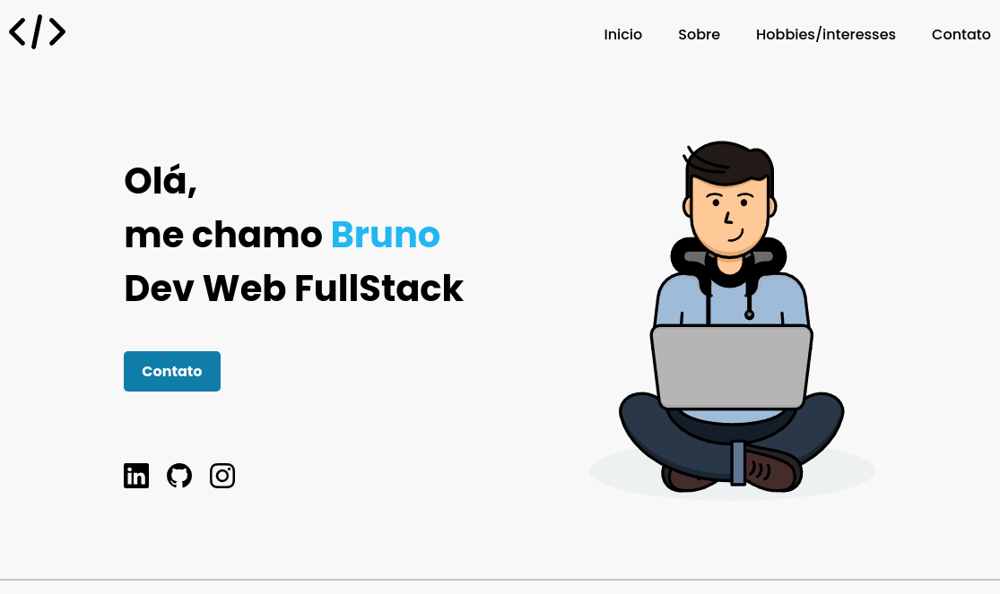

# Projeto individual Resilia 🚀

> PROJETO INDIVIDUAL MÓDULO 1

[🔗 Clique aqui para acessar](https://nobrupsiq.github.io/projeto-individual-resilia/)

## 🛠 Tecnologias

-   HTML
-   CSS
-   Git e Github
-   Figma

### HTML

-   Trabalhei com acessibilidade utilizando `alt` nas imagens e também fiz uso do atributo `tabindex` para facilitar na navegação por TABS

 

## Sobre o projeto

> A página de apresentação individual deve conter 3 seções linkadas no topo do site:

-   Resumo/quem é você
-   Hobbie e interesses
-   Formulário de contato

 

## 📚 o que eu aprendi?

Algumas coisas foram novas e outras foram reforçadas.

Preciso entender melhor como funciona a responsividade.
Pesquisando mais sobre responsividade, descobri alguns `Media queries` coringas

 Estilos para tablets  
 <code>@media only screen and (min-width: 768px) and (max-width: 979px) {}</code>

 Estilos para smartphones  
 <code>@media only screen and (max-width: 787px) {}</code>

